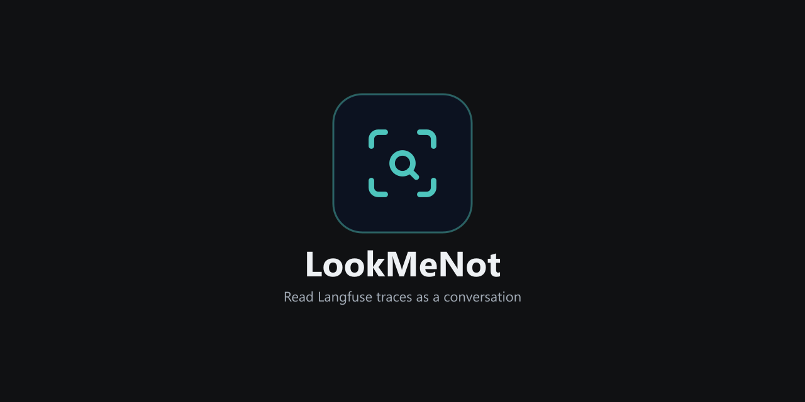

<div align="center">
  
</div>

<div align="center">

[](LICENSE)
[](https://github.com/SunilKumarPradhan/LookMeNot/commits/main)
[](https://github.com/SunilKumarPradhan/LookMeNot/issues)

</div>

# LookMeNot

A browser extension that renders a Langfuse trace as a conversation — messages, tool calls, tool results, and thinking blocks in order — instead of a tree of nested JSON. It opens as a side pane over the Langfuse UI, reads trace data already on the page, and never sends that data anywhere else.

Unofficial project. Not affiliated with or endorsed by Langfuse.

## Install

**PowerShell (Windows, Chrome or Edge):**

```powershell
irm https://raw.githubusercontent.com/SunilKumarPradhan/LookMeNot/main/scripts/install.ps1 | iex
```

Downloads the latest build, unpacks it to `%LOCALAPPDATA%\LookMeNot`, and opens your browser's extensions page with the folder path copied to your clipboard. Chrome and Edge don't allow a browser extension to install itself outside their stores — that's a deliberate security boundary, not a limitation of this script — so two clicks stay manual: turn on **Developer mode**, then **Load unpacked** and paste the path. See [scripts/install.ps1](scripts/install.ps1) if you want to read it before running it.

**From source (any OS):**

```bash
git clone https://github.com/SunilKumarPradhan/LookMeNot.git
cd LookMeNot/extension
npm ci
npm run build:firefox   # or: npm run build:chrome
```

Then load `extension/dist/firefox/manifest.json` (Firefox: `about:debugging#/runtime/this-firefox` → Load Temporary Add-on) or `extension/dist/chrome` (Chrome/Edge: `chrome://extensions` → Developer mode → Load unpacked).

**Store listings:** the [extension](extension/) is built and ready for the Firefox, Chrome, and Edge stores; submission is tracked in [extension/PUBLISHING.md](extension/PUBLISHING.md). Once live, this section will carry direct install links.

## What it does

- Opens automatically on `*.cloud.langfuse.com`, or on a self-hosted Langfuse page via the toolbar button.
- Reads trace JSON the page already loaded — from its own API responses or embedded page data — and renders messages, thinking blocks, tool calls, and tool results as a timeline.
- Search, per-type filters, expand/collapse, and jump-to-entry for long traces.
- Manual JSON upload or paste, for traces the page doesn't expose automatically.
- Everything stays in the tab: no server, no analytics, no stored data.

## Repository layout

```text
LookMeNot/
├─ extension/    Browser extension — source, build, store listings, publishing guide
├─ backend/      Python parser (Langfuse-shaped JSON → ChatEntry[]) + FastAPI wrapper
├─ frontend/     Standalone React viewer that exercises the same parser contract
└─ scripts/      install.ps1, and a stress-test trace generator for the parser
```

The extension is self-contained: its own `src/`, its own parser, its own build. `backend/` and `frontend/` are a second, independent implementation of the same idea as a web app — useful for testing the parser contract without a browser.

## Parser contract

Both implementations flatten a raw Langfuse-shaped trace into a flat list of entries:

```ts
interface ChatEntry {
  index: number;
  role: "user" | "assistant" | "tool" | "system";
  type: "text" | "thinking" | "tool_use" | "tool_result" | "unknown";
  text: string;
  tool?: string;
  toolInput?: string;
  toolInputRaw?: unknown;
  toolUseId?: string;
  isError?: boolean;
  messageIndex: number;
  rawRole: string;
}
```

One content block becomes one entry. Langfuse often nests `tool_result` blocks inside messages with `role: "user"`; both parsers normalize those entries to `role: "tool"` and keep the original role in `rawRole`.

## Development

```powershell
# Extension
cd extension
npm ci
npm run build:firefox
npm run lint:firefox     # Mozilla's add-on linter — expect 0 errors, 2 warnings (see extension/README.md)

# Backend parser tests
cd backend
python -m pytest

# Standalone web viewer
make install && make up          # or, without make: see CONTRIBUTING.md
```

## Privacy

Trace content is processed in the browser tab. The extension makes no network requests of its own, has no analytics, telemetry, or remote code, and stores nothing. Details: [extension/store/privacy-policy.md](extension/store/privacy-policy.md).

## Contributing

See [CONTRIBUTING.md](CONTRIBUTING.md). Issues and feature requests: [GitHub Issues](https://github.com/SunilKumarPradhan/LookMeNot/issues).

## License

[MIT](LICENSE)
